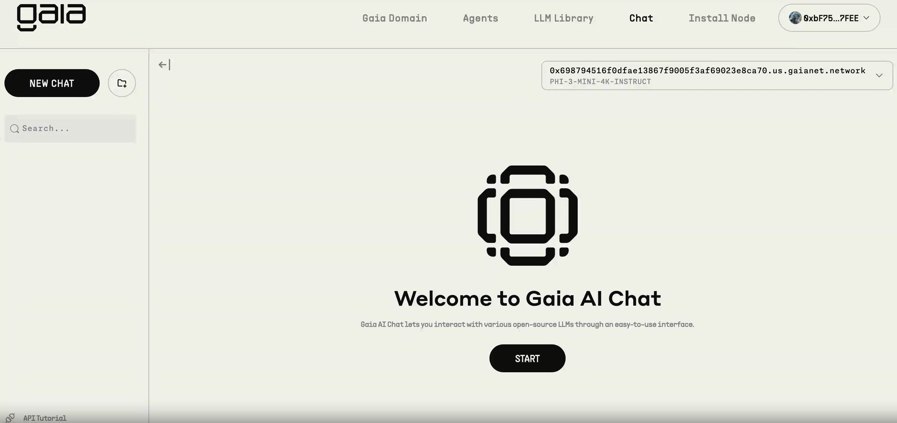
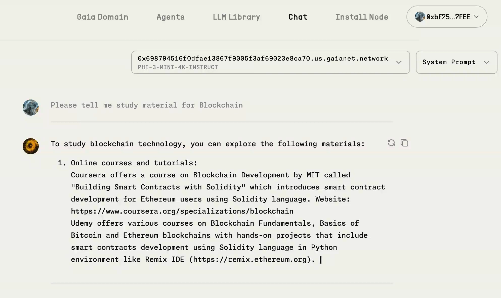

# Study Material AI

Study Material AI is a chatbot specifically designed to assist users with study-material-related inquiries. By feeding data about various career options and advice into a large language model (LLM), this chatbot provides insightful information and recommendations for career decisions, identification of opportunities, and overall guidance.

## Deploy By GaiaNet Demo:

`Demo`: [Gaianet](https://www.gaianet.ai/chat?subdomain=0xc%2F1696b9afc77499306d0981dffa54%2Fdb1e7%2F456.us.gaianet.network)

## Features
- User-friendly interface for answering career-related questions.
- Comprehensive repository of career guidance-related information.
- Personalized guidance and recommendations based on user inputs.

## Installation
To get started with Study Material AI, follow these steps:

1. Clone the repository:
   git clone https://github.com/BoddepallyVenkatesh06/Study_Material_AI.git 
   cd Study Material AI

2. Install the Gaia Node:
   curl -sSfL 'https://github.com/GaiaNet-AI/gaianet-node/releases/latest/download/install.sh' | bash

3. Update the config.json file to run with a small language model:
   gaianet init --config https://raw.githubusercontent.com/harishkotra/Gaia-8G/refs/heads/main/config_8g.json

4. Start the node:
   gaianet start

## How to Use
1. Open your web browser and navigate to the generated link.
2. Start interacting with the chatbot by typing your career guidance-related questions.

## ScreenShot

